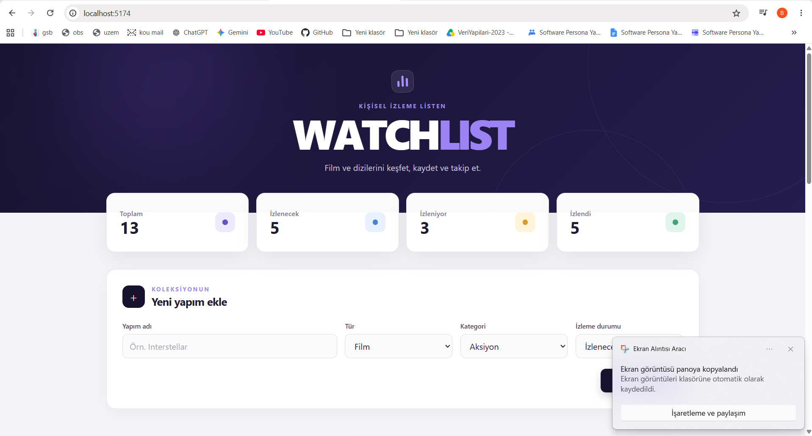
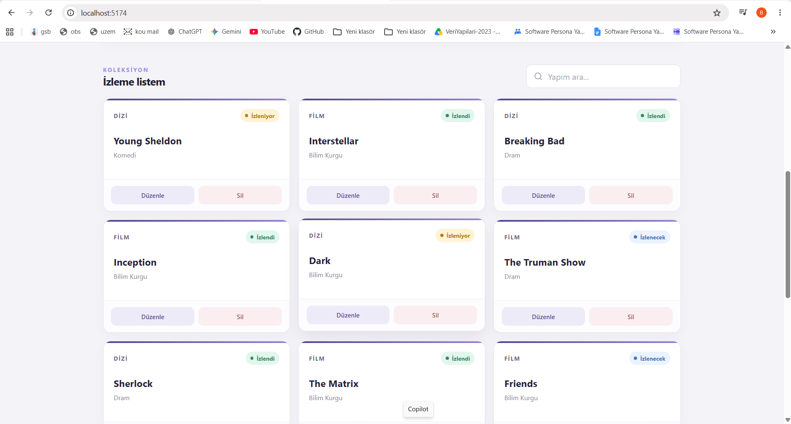
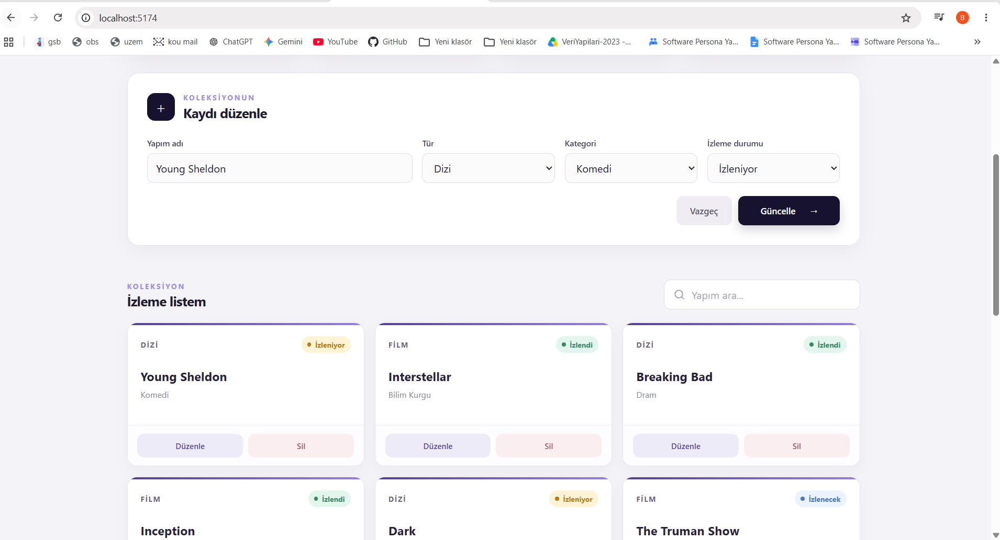

# WatchList

WatchList, film ve dizileri takip etmek için geliştirilmiş basit bir React uygulamasıdır.

## Özellikler

- Film ve dizi ekleme
- Kayıtları listeleme
- Kayıt güncelleme
- Kayıt silme
- İzleme durumu takibi
- Yapım adına göre arama
- LocalStorage ile verileri saklama

## Kullanılan Teknolojiler

- React
- Vite
- JavaScript
- Pure CSS
- LocalStorage

## Proje Görselleri

### Ana Sayfa


### Film ve Dizi Listesi


### Güncelleme İşlemi


## Kurulum

```bash
npm install
npm run dev